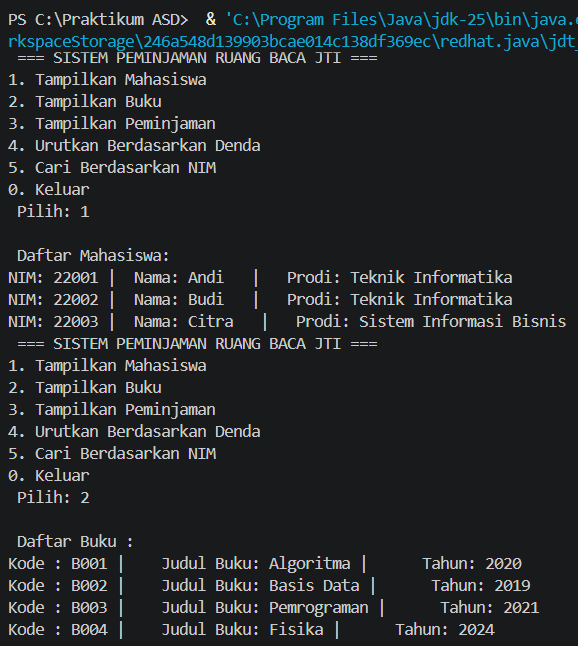
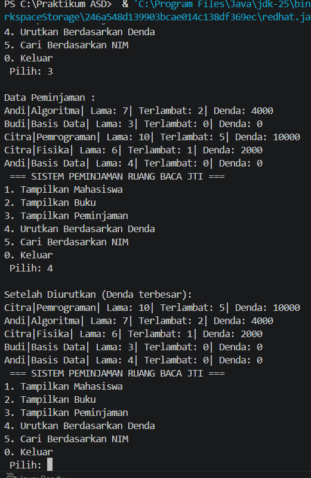
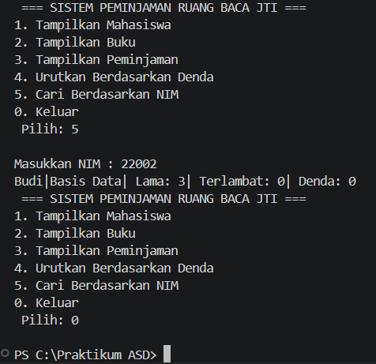

|  | Algoritma dan Struktur Data |
|--|--|
| NIM |  254107020152|
| Nama |  Alya Mukhbita Larassati |
| Kelas | TI - 1F |
| Repository | [link] https://github.com/alyamukhbita237-cloud/Praktikum-ASD-2026.git

### CASE METHOD 1
 
Hasil Running
```
 === SISTEM PEMINJAMAN RUANG BACA JTI ===
1. Tampilkan Mahasiswa
2. Tampilkan Buku
3. Tampilkan Peminjaman
4. Urutkan Berdasarkan Denda
5. Cari Berdasarkan NIM
0. Keluar
 Pilih: 1

 Daftar Mahasiswa:
NIM: 22001 |  Nama: Andi   |   Prodi: Teknik Informatika
NIM: 22002 |  Nama: Budi   |   Prodi: Teknik Informatika
NIM: 22003 |  Nama: Citra   |   Prodi: Sistem Informasi Bisnis
 === SISTEM PEMINJAMAN RUANG BACA JTI ===
1. Tampilkan Mahasiswa
2. Tampilkan Buku
3. Tampilkan Peminjaman
4. Urutkan Berdasarkan Denda
5. Cari Berdasarkan NIM
0. Keluar
 Pilih: 2

 Daftar Buku : 
Kode : B001 |    Judul Buku: Algoritma |      Tahun: 2020
Kode : B002 |    Judul Buku: Basis Data |      Tahun: 2019
Kode : B003 |    Judul Buku: Pemrograman |      Tahun: 2021
Kode : B004 |    Judul Buku: Fisika |      Tahun: 2024
 === SISTEM PEMINJAMAN RUANG BACA JTI === 
1. Tampilkan Mahasiswa 
2. Tampilkan Buku
3. Tampilkan Peminjaman 
4. Urutkan Berdasarkan Denda 
5. Cari Berdasarkan NIM 
0. Keluar 
 Pilih: 3

Data Peminjaman :
Andi|Algoritma| Lama: 7| Terlambat: 2| Denda: 4000
Budi|Basis Data| Lama: 3| Terlambat: 0| Denda: 0
Citra|Pemrograman| Lama: 10| Terlambat: 5| Denda: 10000
Citra|Fisika| Lama: 6| Terlambat: 1| Denda: 2000
Andi|Basis Data| Lama: 4| Terlambat: 0| Denda: 0
 === SISTEM PEMINJAMAN RUANG BACA JTI ===
1. Tampilkan Mahasiswa
2. Tampilkan Buku
3. Tampilkan Peminjaman
4. Urutkan Berdasarkan Denda
5. Cari Berdasarkan NIM
0. Keluar
 Pilih: 4

Setelah Diurutkan (Denda terbesar):
Citra|Pemrograman| Lama: 10| Terlambat: 5| Denda: 10000
Andi|Algoritma| Lama: 7| Terlambat: 2| Denda: 4000
Citra|Fisika| Lama: 6| Terlambat: 1| Denda: 2000
Budi|Basis Data| Lama: 3| Terlambat: 0| Denda: 0
Andi|Basis Data| Lama: 4| Terlambat: 0| Denda: 0
 === SISTEM PEMINJAMAN RUANG BACA JTI ===
1. Tampilkan Mahasiswa
2. Tampilkan Buku
3. Tampilkan Peminjaman
4. Urutkan Berdasarkan Denda
5. Cari Berdasarkan NIM
0. Keluar
 Pilih: 5

Masukkan NIM : 22002
Budi|Basis Data| Lama: 3| Terlambat: 0| Denda: 0
 === SISTEM PEMINJAMAN RUANG BACA JTI ===
1. Tampilkan Mahasiswa
2. Tampilkan Buku
3. Tampilkan Peminjaman
4. Urutkan Berdasarkan Denda
5. Cari Berdasarkan NIM
0. Keluar
 Pilih: 0

PS C:\Praktikum ASD> c:\Praktikum ASD\CM1\ss1.png
```

Screenshoot Hasil Running


