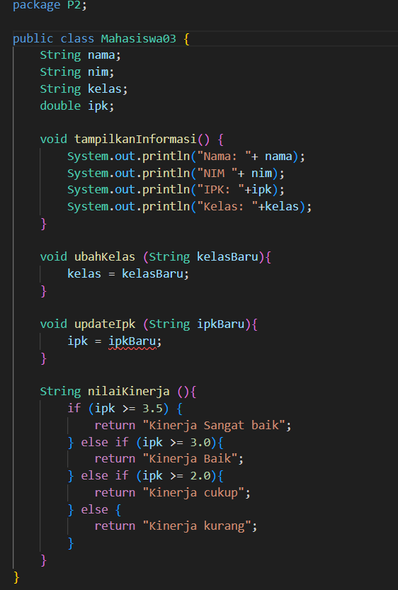
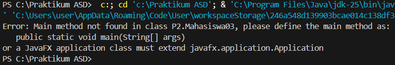
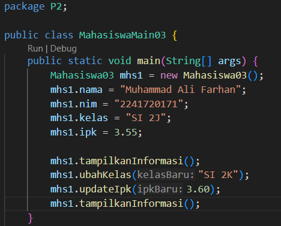
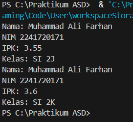
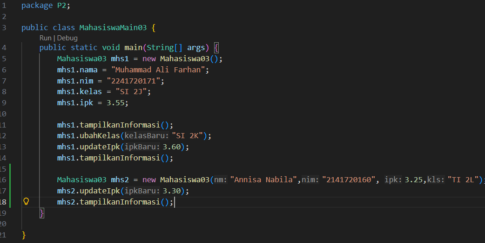
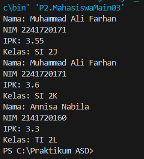
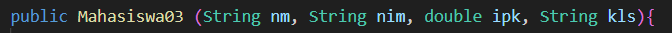
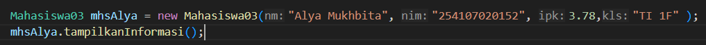
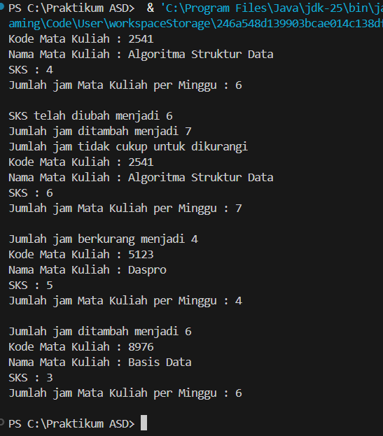
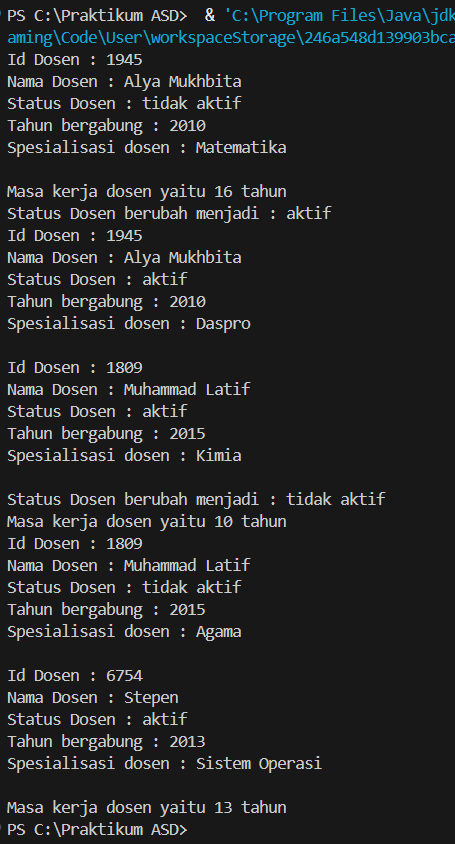

|  | Algoritma dan Struktur Data |
|--|--|
| NIM |  254107020152|
| Nama |  Alya Mukhbita Larassati |
| Kelas | TI - 1F |
| Repository | [link] https://github.com/alyamukhbita237-cloud/Praktikum-ASD-2026.git

# Jobsheet 2 OBJECT

## 2.1 

### 2.1.1 Percobaan 1

### 2.1.2 Verifikasi Hasil Percobaan

### 2.1.3 Pertanyaan

1. Sebutkan dua karakteristik class atau object!
    - dua karakteristik class atau object adalah atribut dan method/fungsi

2. Perhatikan class Mahasiswa pada Praktikum 1 tersebut, ada berapa atribut yang dimiliki oleh class
Mahasiswa? Sebutkan apa saja atributnya!
    - pada class Mahasiswa memiliki 4 atribut yaitu String nama; String nim; String kelas; double ipk;

3. Ada berapa method yang dimiliki oleh class tersebut? Sebutkan apa saja methodnya!
    - ada 4 method, yaitu tampilkanInformasi(): void; ubahKelas(kelasBaru: String): void; updateIpk(ipkBaru: double): void; nilaiKinerja(ipk: double): String

4. Modifikasi kode program 
   - 

5. Jelaskan bagaimana cara kerja method nilaiKinerja() dalam mengevaluasi kinerja mahasiswa, kriteria apa saja yang digunakan untuk menentukan nilai kinerja tersebut, dan apa yang dikembalikan (di-return-kan) oleh method nilaiKinerja() tersebut?
    - method nilaiKinerja() bekerja dengan cara mengecek kondisi nilai IPK (>= 3.5 kinerja sangat baik, >=3.0 kinerja baik, >=2.0 kinerja cukup, dan <2.0 kinerja kurang). Method nilaiKinerja() mengembalikan nilai bertipe String berupa kategori kinerja mahasiswa.

## 2.2

### 2.2.1 Percobaan 2

### 2.2.2 Verifikasi Hasil Percobaan

### 2.2.3 Pertanyaan

1. Pada class MahasiswaMain, tunjukkan baris kode program yang digunakan untuk proses instansiasi! Apa nama object yang dihasilkan?
    - 
    nama object yang dihasilkan yaitu mhs1

2.  Bagaimana cara mengakses atribut dan method dari suatu objek?
    - Atribut diakses dengan namaObjek.namaAtribut, sedangkan method dipanggil dengan namaObjek.namaMethod().

3. Mengapa hasil output pemanggilan method tampilkanInformasi() pertama dan kedua berbeda?
    - karena sebelum pemanggilan method tampilkanInformasi() yang kedua telah dilakukan perubahan nilai atribut objek, sehingga output yang dihasilkan berbeda

## 2.3 

###   2.3.1 Percobaan 3

### 2.3.2 Verifikasi Hasil Percobaan

### 2.3.3 Pertanyaan

1. Pada class Mahasiswa di Percobaan 3, tunjukkan baris kode program yang digunakan untuk mendeklarasikan konstruktor berparameter!
    - 

2. Perhatikan class MahasiswaMain. Apa sebenarnya yang dilakukan pada baris program berikut? 
    - baris program tersebut melakukan instansiasi pada konstruktor berparameter

3. Hapus konstruktor default pada class Mahasiswa, kemudian compile dan run program. Bagaimana hasilnya? Jelaskan mengapa hasilnya demikian!
    - program tidak dapat dijalankan karena objek dibuat tanpa parameter (new Mahasiswa03()), sementara konstruktor tanpa parameter sudah dihapus dan tidak tersedia lagi.

4. Setelah melakukan instansiasi object, apakah method di dalam class Mahasiswa harus diakses secara berurutan? Jelaskan alasannya!
    - tidak, method dalam class tidak harus diakses secara berurutan. Method dapat dipanggil sesuai kebutuhan di dalam program. Urutan eksekusi ditentukan oleh urutan pemanggilan di dalam main, bukan urutan penulisan method di dalam class.

5. Buat object baru dengan nama mhs<NamaMahasiswa> menggunakan konstruktor berparameter dari class Mahasiswa!
    - 

## 2.4 Latihan Praktikum

### Latihan 1

- 

### Latihan 2

- 

    

