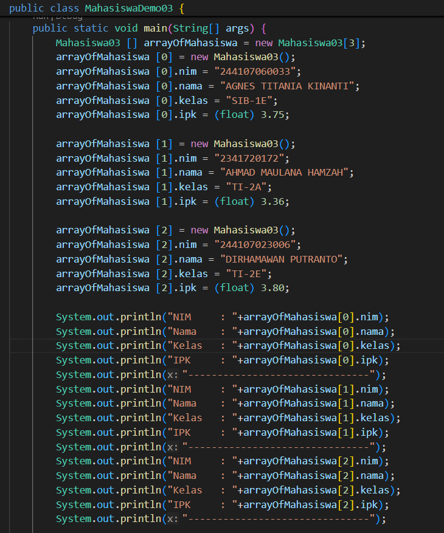
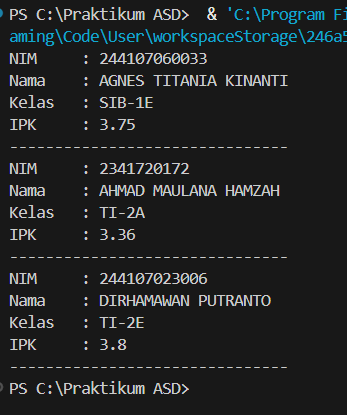
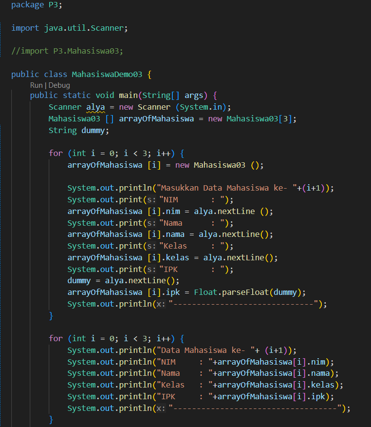
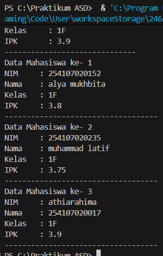
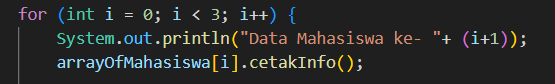
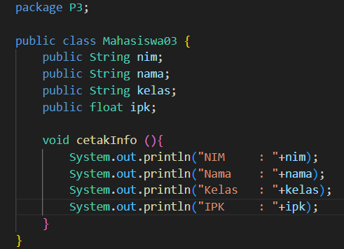

|  | Algoritma dan Struktur Data |
|--|--|
| NIM |  254107020152|
| Nama |  Alya Mukhbita Larassati |
| Kelas | TI - 1F |
| Repository | [link] https://github.com/alyamukhbita237-cloud/Praktikum-ASD-2026.git

# Jobsheet 3 ARRAY OF OBJECTS

### 3.2.1 Percobaan 1

### 3.2.2 Verifikasi Hasil Percobaan

### 3.2.3 Pertanyaan
1. Berdasarkan uji coba 3.2, apakah class yang akan dibuat array of object harus selalu memiliki atribut dan sekaligus method Jelaskan!
    - Tidak, class yang akan dibuat di array of object tidak harus memiliki atribut dan sekaligus method, karena array of object hanya butuh tipe class, sedangkan atribut dan method adalah isi dari class. Selama class bisa dibuat objeknya (new), array tetap bisa dibuat

2. Apa yang dilakukan oleh kode program berikut?
    - membuat arrayOfMahasiswa yang dapat menampung 3 objek Mahasiwa

3. Apakah class Mahasiswa memiliki konstruktor? Jika tidak, kenapa bisa dilakukan pemanggilan
konstruktur pada baris program berikut?
    - tidak, tetap bisa dilakukan pemanggilan kosntruktor karena java otomatis menyediakan default constructor karena itu new Mahasiswa () tetap bisa dijalankan.

4. Apa yang dilakukan oleh kode program berikut?
    - mengisi elemen array, dengan menginstansiasi objek mahasiswa
 
5. Mengapa class Mahasiswa dan MahasiswaDemo dipisahkan pada uji coba 3.2?
    - class mahasiswa hanya bertugas untuk mendefinisikan objek mahasiswa sedangkan mahasiswaDemo bertugas untuk menjalankan dan mengetes class mahasiswa

### 3.3.1 Percobaan 2

### 3.3.2 Verifikasi Hasil Percobaan

### 3.3.3 Pertanyaan

1. Tambahkan method cetakInfo() pada class Mahasiswa kemudian modifikasi kode program pada langkah no 3.
    - 
    - 

