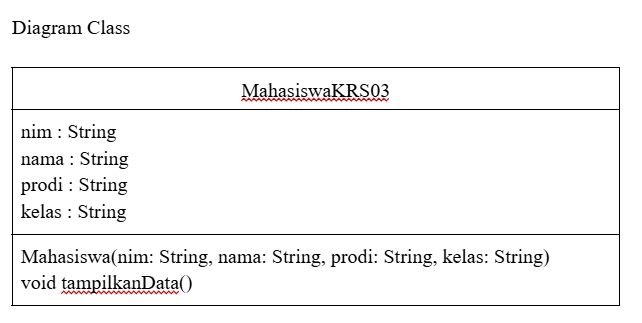
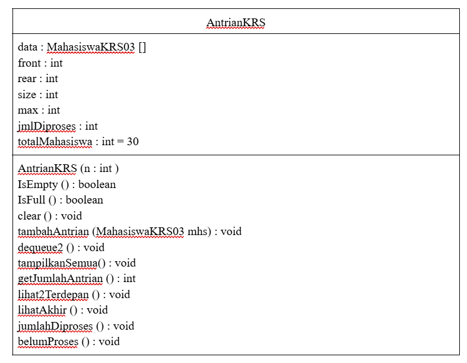

|  | Algoritma dan Struktur Data |
|--|--|
| NIM |  254107020152|
| Nama |  Alya Mukhbita Larassati |
| Kelas | TI - 1F |
| Repository | [link] https://github.com/alyamukhbita237-cloud/Praktikum-ASD-2026.git

# JOBSHEET X QUEUE

## 2.1 Percobaan 1 : Operasi Dasar Queue

Hasil Run :
```java
Masukkan kapasitas queue: 4
Masukkan operasi yang diinginkan: 
1. Enqueue 
2. Dequeue
3. Print
4. Peek
5. Clear
--------------------
1
Masukkan data baru: 15
Masukkan operasi yang diinginkan: 
1. Enqueue 
2. Dequeue
3. Print
4. Peek
5. Clear
--------------------
1
Masukkan data baru: 31
Masukkan operasi yang diinginkan: 
1. Enqueue 
2. Dequeue
3. Print
4. Peek
5. Clear
--------------------
4
Elemen terdepan: 15
Masukkan operasi yang diinginkan: 
1. Enqueue 
2. Dequeue
3. Print
4. Peek
5. Clear
--------------------
6
```

### 2.1.3. Pertanyaan
1. Pada konstruktor, mengapa nilai awal atribut front dan rear bernilai -1, sementara atribut size
bernilai 0?
- karena front dan rear digunakan sebagai penanda bahwa queue masih kosong dan belum menunjuk ke index manapun sehingga diisi -1. Sedangkan size diisi 0 karena menunjukkan jumlah elemen pada queue

2. Pada method Enqueue, jelaskan maksud dan kegunaan dari potongan kode berikut!
```java
if (rear == max-1){
    rear = 0;
```
- kode tersebut untuk mengecek apakah posisi rear sudah berada di indeks terakhir array (max-1), jika sudah di ujung array, maka posisi rear dikembalikan ke indeks 0.

3. Pada method Dequeue, jelaskan maksud dan kegunaan dari potongan kode berikut!
```java
if (front == max -1){
    front = 0;
```
- kode tersebut untuk mengecek apakah posisi front sudah berada di indeks terakhir array (max-1). jika iya, maka posisi front dikembalikan ke indeks 0.

4. Pada method print, mengapa pada proses perulangan variabel i tidak dimulai dari 0 (int i=0),
melainkan int i=front?
- karena pada queue/circular queue, data pertama tidak selalu berada di indeks 0

5. Perhatikan kembali method print, jelaskan maksud dari potongan kode berikut!
```java
i = (i + 1) %max;
```
- potongan kode tersebut pada circular queue digunakan untuk memindakan indeks ke posisi berikutnya secara melingkar.

6. Tunjukkan potongan kode program yang merupakan queue overflow!
```java
if (IsFull()) {
    System.out.println("Queue sudah penuh");
    }
```

7. Pada saat terjadi queue overflow dan queue underflow, program tersebut tetap dapat berjalan
dan hanya menampilkan teks informasi. Lakukan modifikasi program sehingga pada saat terjadi
queue overflow dan queue underflow, program dihentikan!
- kode program sebelum di modifikasi
```java
if (IsFull()) {
    System.out.println("Queue penuh");
}
if (IsEmpty()) {
    System.out.println("Queue masih kosong");
}
```
- kode program setelah di modifikasi
```java
if (IsFull()) {
    System.out.println("Queue sudah penuh, Program dihentikan.");
    System.exit(0);
    }
if (IsEmpty()) {
    System.out.println("Queue masih kosong, Program dihentikan.");
    System.exit(0);
}
```

## 2.2 Percobaan 2 : Antrian Layanan Akademik

Hasil Run :
```java
=== Menu Antrian Layanan Akademik ===
1. Tambah Mahasiswa ke Antrian
2. Layani Mahasiswa
3. Lihat Mahasiswa Terdepan 
4. Lihat Semua Antrian
5. Jumlah Mahasiswa dalam Antrian
0. Keluar
Pilih Menu: 1
NIM   : 123
Nama  : Aldi
Prodi : TI
Kelas : 1A
Aldi berhasil masuk ke antrian.

=== Menu Antrian Layanan Akademik ===
1. Tambah Mahasiswa ke Antrian
2. Layani Mahasiswa
3. Lihat Mahasiswa Terdepan 
4. Lihat Semua Antrian
5. Jumlah Mahasiswa dalam Antrian
0. Keluar
Pilih Menu: 1
NIM   : 124
Nama  : Bobi
Prodi : TI
Kelas : 1G
Bobi berhasil masuk ke antrian.

=== Menu Antrian Layanan Akademik ===
1. Tambah Mahasiswa ke Antrian
2. Layani Mahasiswa
3. Lihat Mahasiswa Terdepan 
4. Lihat Semua Antrian
5. Jumlah Mahasiswa dalam Antrian
0. Keluar
Pilih Menu: 4
Daftar Mahasiswa dalam Antrian: 
NIM - NAMA - PRODI - KELAS
1. 123 - Aldi - TI - 1A
2. 124 - Bobi - TI - 1G

=== Menu Antrian Layanan Akademik ===
1. Tambah Mahasiswa ke Antrian
2. Layani Mahasiswa
3. Lihat Mahasiswa Terdepan 
4. Lihat Semua Antrian
5. Jumlah Mahasiswa dalam Antrian
0. Keluar
Pilih Menu: 2
Melayani mahasiswa: 123 - Aldi - TI - 1A

=== Menu Antrian Layanan Akademik ===
1. Tambah Mahasiswa ke Antrian
2. Layani Mahasiswa
3. Lihat Mahasiswa Terdepan 
4. Lihat Semua Antrian
5. Jumlah Mahasiswa dalam Antrian
0. Keluar
Pilih Menu: 4
Daftar Mahasiswa dalam Antrian: 
NIM - NAMA - PRODI - KELAS
1. 124 - Bobi - TI - 1G

=== Menu Antrian Layanan Akademik ===
1. Tambah Mahasiswa ke Antrian
2. Layani Mahasiswa
3. Lihat Mahasiswa Terdepan 
4. Lihat Semua Antrian
5. Jumlah Mahasiswa dalam Antrian
0. Keluar
Pilih Menu: 5
Jumlah dalam antrian: 1

=== Menu Antrian Layanan Akademik ===
1. Tambah Mahasiswa ke Antrian
2. Layani Mahasiswa
3. Lihat Mahasiswa Terdepan 
4. Lihat Semua Antrian
5. Jumlah Mahasiswa dalam Antrian
0. Keluar
Pilih Menu: 0
Terima kasih.
```
### 2.2.3 Pertanyaan
- Hasil Running modifikasi kode program 

```java
=== Menu Antrian Layanan Akademik ===
1. Tambah Mahasiswa ke Antrian
2. Layani Mahasiswa
3. Lihat Mahasiswa Terdepan 
4. Lihat Semua Antrian
5. Jumlah Mahasiswa dalam Antrian
6. Cek Antrian Paling Belakang
0. Keluar
Pilih Menu: 1
NIM   : 123
Nama  : alya
Prodi : ti
Kelas : 1f
alya berhasil masuk ke antrian.

=== Menu Antrian Layanan Akademik ===
1. Tambah Mahasiswa ke Antrian
2. Layani Mahasiswa
3. Lihat Mahasiswa Terdepan 
4. Lihat Semua Antrian
5. Jumlah Mahasiswa dalam Antrian
6. Cek Antrian Paling Belakang
0. Keluar
Pilih Menu: 1
NIM   : 125
Nama  : cindy
Prodi : ti
Kelas : 1f
cindy berhasil masuk ke antrian.

=== Menu Antrian Layanan Akademik ===
1. Tambah Mahasiswa ke Antrian
2. Layani Mahasiswa
3. Lihat Mahasiswa Terdepan 
4. Lihat Semua Antrian
5. Jumlah Mahasiswa dalam Antrian
6. Cek Antrian Paling Belakang
0. Keluar
Pilih Menu: 6
Antrian paling belakang: 
125 - cindy - ti - 1f

=== Menu Antrian Layanan Akademik ===
1. Tambah Mahasiswa ke Antrian
2. Layani Mahasiswa
3. Lihat Mahasiswa Terdepan 
4. Lihat Semua Antrian
5. Jumlah Mahasiswa dalam Antrian
6. Cek Antrian Paling Belakang
0. Keluar
Pilih Menu: 0
Terima kasih
```

## 2.3 Tugas
- Hasil Running
```java
=== ANTRIAN PERSETUJUAN KRS ===
1. Tambah Antrian
2. Panggil Antrian (2 Mahasiswa)
3. Tampilkan Semua Antrian
4. Tampilkan 2 Antrian Terdepan
5. Tampilkan Antrian Paling Belakang
6. Cek Jumlah Antrian
7. Jumlah Sudah Proses KRS
8. Jumlah Belum Proses KRS
9. Kosongkan Antrian
0. Keluar
Pilih menu : 1
NIM   : 123
Nama  : alya
Prodi : ti
Kelas : 1f
alya berhasil masuk ke antrian.

=== ANTRIAN PERSETUJUAN KRS ===
1. Tambah Antrian
2. Panggil Antrian (2 Mahasiswa)
3. Tampilkan Semua Antrian
4. Tampilkan 2 Antrian Terdepan
5. Tampilkan Antrian Paling Belakang
6. Cek Jumlah Antrian
7. Jumlah Sudah Proses KRS
8. Jumlah Belum Proses KRS
9. Kosongkan Antrian
0. Keluar
Pilih menu : 1
NIM   : 122
Nama  : cindy
Prodi : ti
Kelas : 1f
cindy berhasil masuk ke antrian.

=== ANTRIAN PERSETUJUAN KRS ===
1. Tambah Antrian
2. Panggil Antrian (2 Mahasiswa)
3. Tampilkan Semua Antrian
4. Tampilkan 2 Antrian Terdepan
5. Tampilkan Antrian Paling Belakang
6. Cek Jumlah Antrian
7. Jumlah Sudah Proses KRS
8. Jumlah Belum Proses KRS
9. Kosongkan Antrian
0. Keluar
Pilih menu : 1
NIM   : 124
Nama  : athia
Prodi : ti
Kelas : 1f
athia berhasil masuk ke antrian.

=== ANTRIAN PERSETUJUAN KRS ===
1. Tambah Antrian
2. Panggil Antrian (2 Mahasiswa)
3. Tampilkan Semua Antrian
4. Tampilkan 2 Antrian Terdepan
5. Tampilkan Antrian Paling Belakang
6. Cek Jumlah Antrian
7. Jumlah Sudah Proses KRS
8. Jumlah Belum Proses KRS
9. Kosongkan Antrian
0. Keluar
Pilih menu : 1
NIM   : 127
Nama  : jovita
Prodi : ti
Kelas : 1f
jovita berhasil masuk ke antrian.

=== ANTRIAN PERSETUJUAN KRS ===
1. Tambah Antrian
2. Panggil Antrian (2 Mahasiswa)
3. Tampilkan Semua Antrian
4. Tampilkan 2 Antrian Terdepan
5. Tampilkan Antrian Paling Belakang
6. Cek Jumlah Antrian
7. Jumlah Sudah Proses KRS
8. Jumlah Belum Proses KRS
9. Kosongkan Antrian
0. Keluar
Pilih menu : 1
NIM   : 128
Nama  : inas
Prodi : ti
Kelas : 1f
inas berhasil masuk ke antrian.

=== ANTRIAN PERSETUJUAN KRS ===
1. Tambah Antrian
2. Panggil Antrian (2 Mahasiswa)
3. Tampilkan Semua Antrian
4. Tampilkan 2 Antrian Terdepan
5. Tampilkan Antrian Paling Belakang
6. Cek Jumlah Antrian
7. Jumlah Sudah Proses KRS
8. Jumlah Belum Proses KRS
9. Kosongkan Antrian
0. Keluar
Pilih menu : 2
Mahasiswa diproses KRS:
123 - alya - ti - 1f
122 - cindy - ti - 1f

=== ANTRIAN PERSETUJUAN KRS ===
1. Tambah Antrian
2. Panggil Antrian (2 Mahasiswa)
3. Tampilkan Semua Antrian
4. Tampilkan 2 Antrian Terdepan
5. Tampilkan Antrian Paling Belakang
6. Cek Jumlah Antrian
7. Jumlah Sudah Proses KRS
8. Jumlah Belum Proses KRS
9. Kosongkan Antrian
0. Keluar
Pilih menu : 3
Daftar Mahasiswa dalam Antrian: 
NIM - NAMA - PRODI - KELAS
1. 124 - athia - ti - 1f
2. 127 - jovita - ti - 1f
3. 128 - inas - ti - 1f

=== ANTRIAN PERSETUJUAN KRS ===
1. Tambah Antrian
2. Panggil Antrian (2 Mahasiswa)
3. Tampilkan Semua Antrian
4. Tampilkan 2 Antrian Terdepan
5. Tampilkan Antrian Paling Belakang
6. Cek Jumlah Antrian
7. Jumlah Sudah Proses KRS
8. Jumlah Belum Proses KRS
9. Kosongkan Antrian
0. Keluar
Pilih menu : 4
2 Mahasiswa terdepan: NIM - NAMA - PRODI - KELAS
124 - athia - ti - 1f
127 - jovita - ti - 1f

=== ANTRIAN PERSETUJUAN KRS ===
1. Tambah Antrian
2. Panggil Antrian (2 Mahasiswa)
3. Tampilkan Semua Antrian
4. Tampilkan 2 Antrian Terdepan
5. Tampilkan Antrian Paling Belakang
6. Cek Jumlah Antrian
7. Jumlah Sudah Proses KRS
8. Jumlah Belum Proses KRS
9. Kosongkan Antrian
0. Keluar
Pilih menu : 5 
Antrian paling belakang: 
128 - inas - ti - 1f

=== ANTRIAN PERSETUJUAN KRS ===
1. Tambah Antrian
2. Panggil Antrian (2 Mahasiswa)
3. Tampilkan Semua Antrian
4. Tampilkan 2 Antrian Terdepan
5. Tampilkan Antrian Paling Belakang
6. Cek Jumlah Antrian
7. Jumlah Sudah Proses KRS
8. Jumlah Belum Proses KRS
9. Kosongkan Antrian
0. Keluar
Pilih menu : 6
Jumlah antrian: 3

=== ANTRIAN PERSETUJUAN KRS ===
1. Tambah Antrian
2. Panggil Antrian (2 Mahasiswa)
3. Tampilkan Semua Antrian
4. Tampilkan 2 Antrian Terdepan
5. Tampilkan Antrian Paling Belakang
6. Cek Jumlah Antrian
7. Jumlah Sudah Proses KRS
8. Jumlah Belum Proses KRS
9. Kosongkan Antrian
0. Keluar
Pilih menu : 7
Jumlah mahasiswa sudah proses KRS : 2

=== ANTRIAN PERSETUJUAN KRS ===
1. Tambah Antrian
2. Panggil Antrian (2 Mahasiswa)
3. Tampilkan Semua Antrian
4. Tampilkan 2 Antrian Terdepan
5. Tampilkan Antrian Paling Belakang
6. Cek Jumlah Antrian
7. Jumlah Sudah Proses KRS
8. Jumlah Belum Proses KRS
9. Kosongkan Antrian
0. Keluar
Pilih menu : 8
Belum proses KRS : 28

=== ANTRIAN PERSETUJUAN KRS ===
1. Tambah Antrian
2. Panggil Antrian (2 Mahasiswa)
3. Tampilkan Semua Antrian
4. Tampilkan 2 Antrian Terdepan
5. Tampilkan Antrian Paling Belakang
6. Cek Jumlah Antrian
7. Jumlah Sudah Proses KRS
8. Jumlah Belum Proses KRS
9. Kosongkan Antrian
0. Keluar
Pilih menu : 9
Queue berhasil dikosongkan

=== ANTRIAN PERSETUJUAN KRS ===
1. Tambah Antrian
2. Panggil Antrian (2 Mahasiswa)
3. Tampilkan Semua Antrian
4. Tampilkan 2 Antrian Terdepan
5. Tampilkan Antrian Paling Belakang
6. Cek Jumlah Antrian
7. Jumlah Sudah Proses KRS
8. Jumlah Belum Proses KRS
9. Kosongkan Antrian
0. Keluar
Pilih menu : 0
Pilihan Tidak Valid.
```

### Gambar Diagram class antrian




